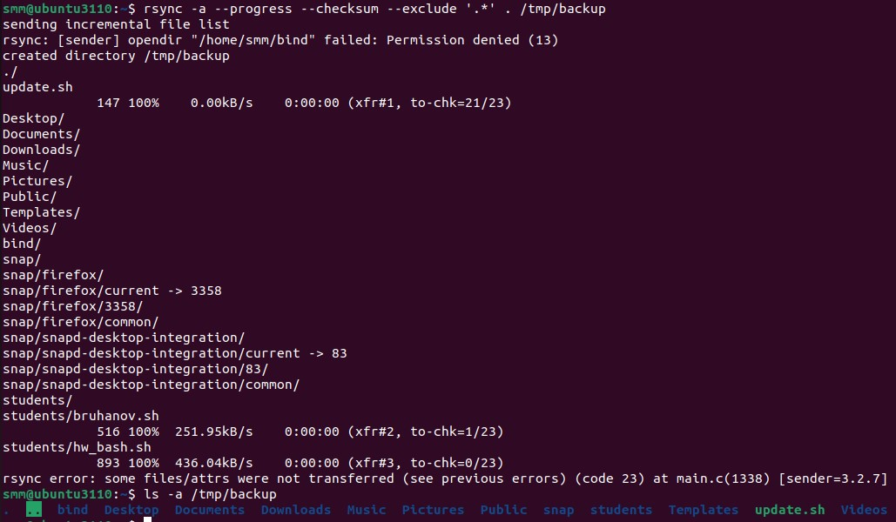
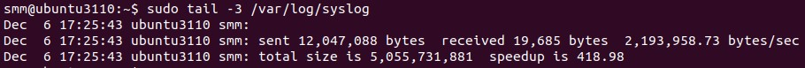

# Домашнее задание к занятию «Резервное копирование» - Михалёв Сергей


---


### Задание 1
- Составьте команду rsync, которая позволяет создавать зеркальную копию домашней директории пользователя в директорию `/tmp/backup`
- Необходимо исключить из синхронизации все директории, начинающиеся с точки (скрытые)
- Необходимо сделать так, чтобы rsync подсчитывал хэш-суммы для всех файлов, даже если их время модификации и размер идентичны в источнике и приемнике.
- На проверку направить скриншот с командой и результатом ее выполнения

---
### Результат.
- Команда (не стал выполнять с правами суперпользователя дабы ограничить список файлов разумными пределами):
  ```
  rsync -a --progress --checksum --exclude '.*' . /tmp/backup

  ```
- Скриншот с командой и результатом ее выполнения
  * 


---

### Задание 2
- Написать скрипт и настроить задачу на регулярное резервное копирование домашней директории пользователя с помощью rsync и cron.
- Резервная копия должна быть полностью зеркальной
- Резервная копия должна создаваться раз в день, в системном логе должна появляться запись об успешном или неуспешном выполнении операции
- Резервная копия размещается локально, в директории `/tmp/backup`
- На проверку направить файл crontab и скриншот с результатом работы утилиты.

### Результат
- Срочка файла crontab:
  ```@daily sudo rsync -a --delete /home/smm /tmp/backup 2>&1 | logger```
- Скриншот результата 
  * 

---
